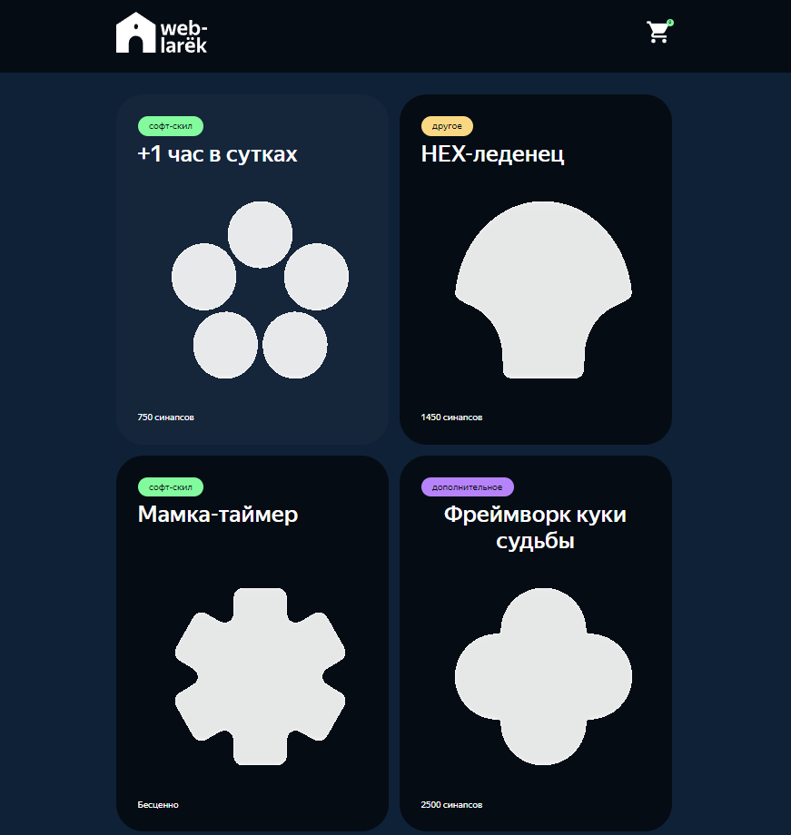

# Проектная работа "Веб-ларек"

Стек: HTML, SCSS, TS, Webpack

Структура проекта:

- src/ — исходные файлы проекта
- src/components/ — папка с JS компонентами
- src/components/base/ — папка с базовым кодом

Важные файлы:

- src/pages/index.html — HTML-файл главной страницы
- src/types/index.ts — файл с типами
- src/index.ts — точка входа приложения
- src/scss/styles.scss — корневой файл стилей
- src/utils/constants.ts — файл с константами
- src/utils/utils.ts — файл с утилитами

## Установка и запуск

Для установки и запуска проекта необходимо выполнить команды

```
npm install
npm run start
```

или

```
yarn
yarn start
```

## Сборка

```
npm run build
```

или

```
yarn build
```
## Web-larek



## Архитектура проекта

Данные (Models):

Хранят и управляют состоянием приложения.
Работают с бизнес-логикой и обеспечивают взаимодействие с API.

Отображение (Views):

Отвечает за рендеринг интерфейса пользователя и взаимодействие с ним.
Реализует компоненты, которые показывают данные и реагируют на действия пользователя.

События (Event Handling):

Обеспечивают механизм обмена данными между моделями и представлениями.
Позволяют слушать и инициировать события для обработки взаимодействий.
 
Зачем нужны эти части?

Модели (Models): хранят и обрабатывают данные, предоставляют интерфейсы для взаимодействия с данными. Они помогают управлять бизнес-логикой приложения.
Представления (Views): отображают данные пользователю, обеспечивая интерактивность через компоненты интерфейса.
События: служат связующим звеном между моделями и представлениями, позволяя им реагировать на изменения данных.

Взаимодействие частей

Компоненты взаимодействуют через события, которые генерируются моделями (например, при изменении состояния). Обработчики событий, находящиеся в представлениях, получают данные и обновляют интерфейс в ответ на изменения.

## Типы данных, используемые в веб-приложении

```
// Интерфейс карточки товара
interface IProductItem {
  id: string; // идентификатор товара
  description: string; // описание товара
  image: string; // URL изображения товара
  title: string; // название товара
  category: TCategoryProduct; // категория товара
  price: number | null; // цена товара, может быть null
}

// Интерфейс формы с адресом доставки
interface IAddressForm {
    payment: string; // способ оплаты
    address: string; // адрес доставки
}

// Интерфейс формы с контактами
interface IContactsForm {
  email: string; // адрес электронной почты
  phone: string; // номер телефона
}

// Интерфейс данных о заказе (при запросе на сервер)
interface IOrder extends IAddressForm, IContactsForm {
  items: string[]; // массив идентификаторов товаров в заказе
  total: number; // общая сумма заказа
}

// Интерфейс успешного ответа от сервера
interface IOrderSuccess {
  id: string; // идентификатор заказа
  total: number; // общая сумма заказа
}

Эти интерфейсы описывают структуру данных, используемых в приложении, что помогает четко определить, какие данные нам нужны для работы с товарами, заказами и формами.

```

## Основные классы

### Класс Api:

Этот класс обрабатывает HTTP-запросы с сервером и возвращает результаты запросов. Сделан для обеспечения основных методов взаимодействия с серверным.

`constructor(baseUrl: string, options: RequestInit = {})`- принимает базовый URL и глобальные опции для всех запросов(опционально).
 
Методы:

- get(URI: string): Promise<any> — выполняет GET запрос.
- post(URI: string, data: any, method = 'POST'): Promise<any> — отправляет POST запрос.
- handleResponse(response: Response): Promise<object> - унифицирует обработку успешных ответов и ошибок, что позволяет легко и систематически управлять ими в других частях кода

### Класс EventEmitter:

Организует обмен данными между компонентами. Обеспечивает возможность установки обработчиков событий, вызова событий и их прослушивания.

Методы класса:

- on(event: string, listener: Function): void — устанавливает обработчик для события.
- off(event: string): void — удаляет обработчик события.
- emit(event: string, args?: any): void — инициирует событие.
- onAll(listener: Function): void — устанавливает обработчик для всех событий.
- offAll(): void — удаляет все обработчики событий.

### Класс Component:

Создает компоненты интерфейса пользователя, управляет элементами DOM. Предоставляет методы для управления элементами DOM и поведением компонентов. Является родительским для всех классов слоя отображения.

Методы:

- `toggleClass`: переключает класс для указанного элемента.
- `protected setText`: устанавливает текстовое содержимое для указанного элемента.
- `protected setImage`: устанавливает изображения и альтернативный текст для указанного элемента.
- `setDisabled`: изменяет статус блокировки для указанного элемента.
- `protected setVisible`: отоброжает указанный элемент.
- `protected setHidden`: скрывает указанный элемент.
- `render`: рендерит компонент, используя переданные данные.

### Класс Model:

Родительский класс для моделей данных, описывает состояние приложения.

Методы:

- `emitChanges`: cообщает о каких-либо изменениях в модели.

## Работы с данными (Model). Основные классы

Модель (Model) отвечает за хранение данных приложения и бизнес-логику, связанную с этими данными. Она предоставляет интерфейс для доступа к данным и операциям над ними, однако не знает, как эти данные будут использоваться в других частях приложения. Является родительским для других классов данных, которые содержат конкретные реализации моделей для различных компонентов или функций приложения.

// abstract class Model<T> {
	constructor(data: Partial<T>, protected events: IEvents) {
		Object.assign(this, data);
	}

	emitChanges(event: string, payload?: object) {
		this.events.emit(event, payload ?? {});
	}
}


### AppState:

Описывает глобальное состояние приложения. При наследовании от Model получает возможность использовать функциональность базовой модели для управления событиями и обновлением данных.

Поля:

- `catalog: IProductItem[]`: Массив объектов товаров в каталоге.
- `order: IOrder`: Объект с данными, необходимыми для формления заказа.
- `formErrors: FormErrors`: Объект, содержащий ошибки, возникающие при некорректном заполнении формы заказа.

Методы класса:

- `toggleOrderedItem`: Метод для добавления или удаления товара из корзины.
- `clearBasket`: Метод для очистки корзины и заказа.
- `getTotal`: Метод для вычисления общей стоимости товаров в корзине.
- `setCatalog`: Метод для установки каталога товаров и отправки соответствующего события об изменении.
- `setOrderField`: Метод для установки значения поля заказа и проверки наличия достаточных данных для оформления заказа.
- `validateOrderForm`: Метод для проверки наличия данных о способе оплаты и адресе доставки.
- `setContactsField`: Метод для установки значения поля контактной информации и проверки наличия достаточных контактных данных для оформления заказа.
- `validateContactsForm`: Метод для проверки наличия данных об электронной почте и номере телефона.
- `resetForm`: Метод для сброса значений формы.

## Компоненты отображения (View):

Слой отображения (View) в приложении отвечает за представление данных и взаимодействие с пользователем. Основная задача состоит в том, чтобы отображать необходимую пользователю информацию и обеспечивать интерфейс для взаимодействия с приложением.


### Modal:

Создает и управляет модальными окнами. Наследуется от: Component Интерфейс: IModalContent. Предоставляет функционал для управления модальными окнами, включая их открытие, закрытие и управление содержимым.

Поля класса:

- `_closeButton: HTMLButtonElement`: Кнопка для закрытия модального окна.
- `_content: HTMLElement`: Элемент контента модального окна.

Методы класса:

- `set content`: Устанавливает содержимое модального окна (сеттер).
- `open`: Открывает модальное окно и отправляет соответствующее событие.
- `close`: Закрывает модальное окно, очищает контент и отправляет соответствующее событие.
- `render`: Выполняет рендеринг модального окна с учетом переданных данных.

Пример использования:

### Card:

Шаблон для создания карточек продуктов. Наследуется от: Component Интерфейс: ICard. Предоставляет основной функционал для отображения карточек продуктов, но сам по себе является абстрактным и не предназначен для создания экземпляров. Он служит в качестве основы для создания конкретных типов карточек продуктов, каждый из которых будет реализовывать свою собственную логику и внешний вид.

Поля класса:

- `protected _title: HTMLElement`: Элемент заголовка продукта.
- `protected _image?: HTMLImageElement`: Элемент изображения продукта.
- `protected _description?: HTMLElement`: Элемент описания продукта.
- `protected _category?: HTMLElement`: Элемент для отображения категории продукта.
- `protected _price: HTMLElement`: Элемент для отображения цены продукта.
- `protected _button?: HTMLButtonElement`: Элемент кнопки.

Методы класса:

- `set id`: Устанавливает идентификатор продукта.
- `set category`: Устанавливает категорию продукта.
- `set title`: Устанавливает заголовок продукта.
- `set description`: Устанавливает описание продукта.
- `set image`: Устанавливает изображение продукта.
- `set buttonText`: Устанавливает текст кнопки.
- `set buttonStatus`: Устанавливает статус активности кнопки.
- `set price`: Устанавливает цену продукта.
- `setColorCategory`: Устанавливает цвет категории карточки.

#### CardCatalog:

Класс, представляющий карточку продукта для отображения в каталоге товаров.
Наследуется от Card. Класс CardCatalog представляет собой карточку товара в каталоге, который используется для отображения списка товаров. Он наследует основной функционал от класса Card и инициализирует дополнительные поля, такие как изображение и категория товара.

#### CardForBasket:

Класс, представляющий карточку товара для отображения в корзине. Наследуется от: Card. Предназначен для представления карточки товара в корзине. Он служит для отображения информации о товаре. Кроме того, класс CardForBasket расширяет функционал класса Card, добавляя инициализацию дополнительного поля — порядкового номера отображающейся в корзине карточки товара.

Поле класса:

- `protected _itemIndex: HTMLElement`: Элемент для отображения порядкого номера карточки в корзине.

Метод класса (сеттер):

- `set index`: Устанавливает порядковый номер карточки в корзине.

#### CardPreview:

Класс, представляющий предварительный просмотр карточки товара.
Наследуется от Card. Необходим для отображения превью выбранной карточки в модальном окне (название, изображение, категория товара, цена, описание товара, кнопка). При нажатии на кнопку "В корзину" карточка добавляется в корзину, а кнопка меняет текст на "Удалить и корзины". Этот класс упрощает пользовательский опыт путем предварительного просмотра товара и позволяет легко осуществлять покупку в модальном окне.

Методы класса:

- `set description`: Устанавливает описания карточки.
- `set buttonText`: Устанавливает текст кнопки карточки.
- `set buttonStatus`: Устанавливает состояния кнопки карточки.

### Page:

Page управляет отображением блока с карточками на основной странице приложения. Наследуется от: Component. Отображает содержимое главной страницы приложения, такое как каталог продуктов и счетчик элементов.

Поля класса:

- `protected _catalog: HTMLElement`: Элемент каталога товаров.
- `protected _basket: HTMLElement`: Элемент корзины.
- `protected _counter: HTMLElement`: Элемент счетчика товаров в корзине.
- `protected _wrapper: HTMLElement`: Элемент обертки страницы.

Методы класса (сеттеры):

- `set catalog`: Устанавливает список элементов каталога товаров на странице.
- `set counter`: Устанавливает значение счетчика товаров в корзине.
- `set locked`: Устанавливает состояние прокрутки.

### Basket:

Basket управляет отображением информации о корзине покупок. Наследуется от: Component. Отображает содержимое корзины покупок, а также предоставляет методы для управления элементами в корзине.

Поля класса:

- `protected _list: HTMLElement`: Элемент списка товаров в корзине.
- `protected _total: HTMLElement`: Элемент для отображения общей стоимости товаров в корзине.
- `protected _button: HTMLElement`: Кнопка для оформления заказа.

Методы класса (сеттеры):

- `set items`: Устанавливает список элементов товаров в корзине.
- `set selected`: Устанавливает состояние книпки оформления заказа (вкл. или выкл.) в зависимости от наличия товаров.
- `set total`: Устанавливает общую стоимость товаров в корзине.

### Form:

 Класс Form управляет отображением и взаимодействием с формами. Наследуется от: Component. Предоставляет общие методы для управления формами, такие как установка значений полей и валидация.

Поля класса:

- `protected _submit: HTMLButtonElement`: Кнопка отправки формы.
- `protected _errors: HTMLElement`: Элемент для отображения ошибок формы.

Методы класса:

- `set valid`: Устанавливает состояние кнопки отправки (активное/неактивное) в зависимости от валидности формы (сеттер).
- `set errors`: Устанавливает значение текста ошибок в форме (сеттер).
- `render`: Выполняет рендеринг компонентов формы с учетом переданного состояния.
- `onInputChange`: Отправляет событие об изменении данных ввода.

#### AddressForm:

Класс формы для ввода адреса доставки товара. Наследуется от: AddressForm наследуется от абстрактного класса Form, который предоставляет базовую функциональность для работы с формами. Класс формы AddressForm предназначен для ввода адреса доставки товара. Он обеспечивает интерфейс для взаимодействия с пользователем, включая поля для ввода адреса и кнопки выбора способа оплаты.

Поле класса:

- `protected _buttonPayments: HTMLButtonElement[]`: Массив с элементами, отвечающими за выбор способа оплаты.

Метод класса (сеттер):

- `set address`: Устанавливает значение для поля адреса.

#### ContactsForm:

Класс формы для ввода контактных данных клиента.  Наследуется от: ContactsForm наследуется от абстрактного класса Form, который предоставляет базовую функциональность для работы с формами.ContactsForm представляет собой форму для ввода контактной информации клиента, такой как адрес электронной почты и номер телефона.

Методы класса (сеттеры):

- `set phonenumber(value: string)`: Устанавливает значение для поля телефона.
- `set email(value: string)`: Устанавливает значение для поля email.

### Success:

Этот класс отвечает за отображение интерфейса успешной покупки. Наследуется от: Component. Success предназначен для отображения сообщения об успешном заказе.


Поля класса:

- `protected _close: HTMLElement`: Элемент для кнопки закрытия сообщения.
- `protected _successSum: HTMLElement`: Элемент для отображения суммы списания.

Метод класса (сеттер):

- `set total`: Устанавливает текст со значением суммы списания.

### OnlineStoreAPI:

Этот класс отвечает за взаимодействия с сервером онлайн-магазина "WebLarek". Наследуется от: Api Интерфейс: IOnlineStoreAPI. OnlineStoreAPI представляет собой клиентский API для взаимодействия с сервером онлайн-магазина "WebLarek". Этот класс расширяет базовый класс Api, который предоставляет методы для выполнения HTTP-запросов.

Поле класса:

- `readonly cdn: string`: URL-адрес контентного сервера.

Методы класса:

- `getCardList`: Метод получения списка товаров.
- `getCardItem`: Метод получения информации о конкретном товаре по его идентификатору.
- `orderProduct`: Метод оформления заказа на товар.

